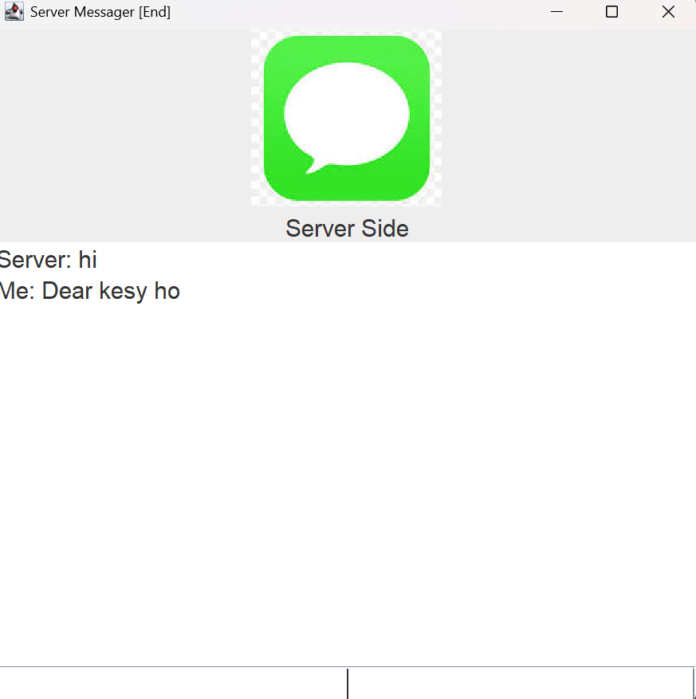

# Java ChatApp (Client-Server)

A simple two-way real-time chat application built using **Java Sockets** and **Swing GUI**. It consists of a **Server** and a **Client** that can communicate with each other through message exchange. This is a basic example of network programming and multithreading in Java.

---

## 🚀 Features

- Real-time message communication
- Graphical User Interface using Swing
- Bi-directional communication (Client ↔ Server)
- Multi-threading for simultaneous reading and writing
- Connection status logs in the console
- "exit" command to close the chat gracefully

---

## 🛠️ Technologies Used

- Java SE
- Swing (for GUI)
- Java Sockets (for networking)
- Multi-threading

---

## 📂 Project Structure

```

ChatApp/
├── Client.java
├── Server.java
├── Message.jpg   # Optional icon used in the GUI

```

---

## 🖥️ How It Works

1. **Server** starts and waits for a client connection.
2. **Client** connects to the server using `127.0.0.1` (localhost) on port `777`.
3. Both applications have a Swing-based GUI where users can type and view messages.
4. Messages are sent using output streams and received using input streams.
5. Typing `exit` will terminate the connection from either side.

---

## ✅ How to Run

### Prerequisites

- JDK 8 or above installed
- Java IDE (e.g., IntelliJ, Eclipse) or Command Line

### Steps

1. Clone or download the project.
2. Open the project in your IDE or terminal.
3. **Run the `Server.java` file first.**
4. Then, **run the `Client.java` file.**
5. Type messages in the input field and press `Enter` to send.
6. To close the chat, type `exit`.

---

## 📸 GUI Screenshot

> *(Add your screenshot here if available)*
> Example:
> 

---

## 💡 Notes

- You can only connect **one client to one server** in this basic version.
- This is for learning purposes; for multiple clients, further enhancements with threading/server handling are needed.
- The `Message.jpg` image should exist in the project directory for the icon to display properly.

---

## 📌 Future Improvements

- Support for multiple clients using threads
- Message timestamps
- Better GUI with chat bubbles
- File sharing feature

---

## 🧑‍💻 Author

**Abu Hurera Junejo**

---

## 📄 License

This project is licensed under the [MIT License](LICENSE).
